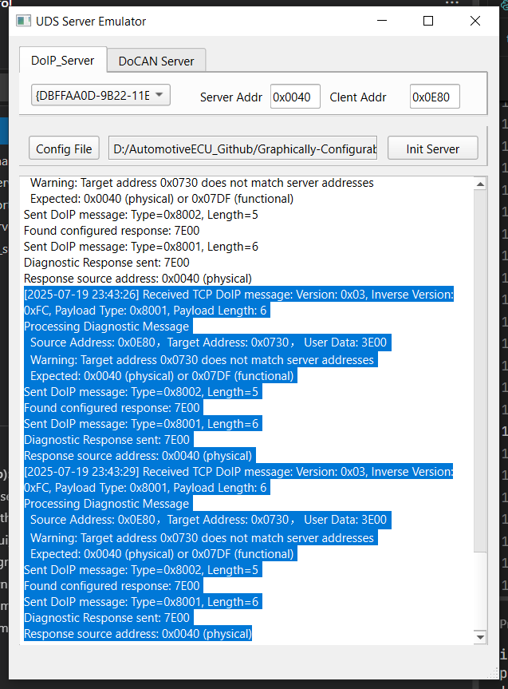

# Graphically Configurable UDS Server Emulator

A graphically configurable UDS (Unified Diagnostic Services) server emulator designed to simulate UDS servers based on different transport protocols.

## Features

- **DoCAN Support**: UDS server simulation over CAN bus
- **DoIP Support**: UDS server simulation over Ethernet
- **Graphical Configuration**: Intuitive configuration interface
- **Multi-Protocol Support**: Simultaneous support for multiple transport protocols

## Supported Transport Protocols

### DoCAN (Diagnostics over CAN) -- Under Developing

- UDS communication over CAN bus
- Dependencies:
  - `python-can`: CAN bus communication library
  - `python-canisotp`: CAN ISO-TP protocol implementation

### DoIP (Diagnostics over Internet Protocol) -- Done

- UDS communication over Ethernet
- Implemented using standard Socket communication
- Supports TCP/UDP transport

### GUI Framework
- Built with PySide6 (Qt for Python)
- Modern and responsive user interface
- Cross-platform compatibility
- Features:
  - Real-time protocol configuration
  - Visual diagnostic session monitoring
  - Interactive parameter adjustment
  - Customizable layout and themes

## Usage

Run the main emulator:

```bash
python main.py
```

 
